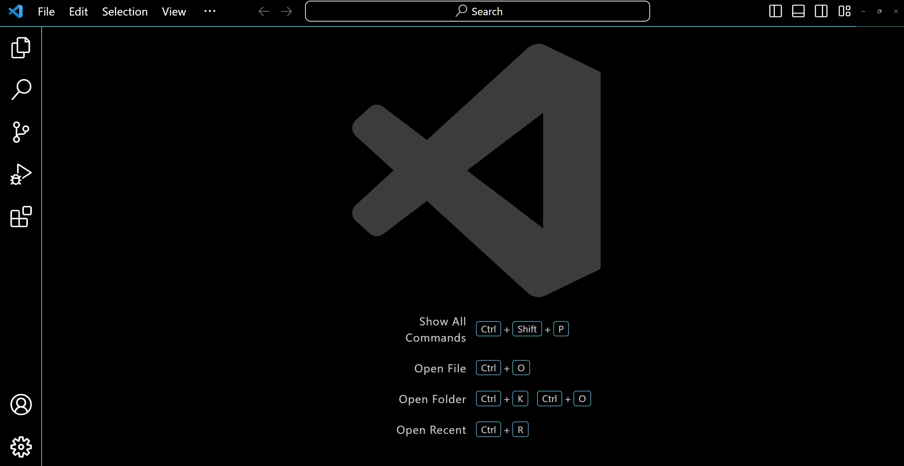
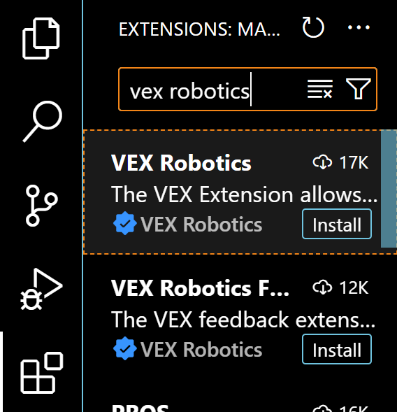
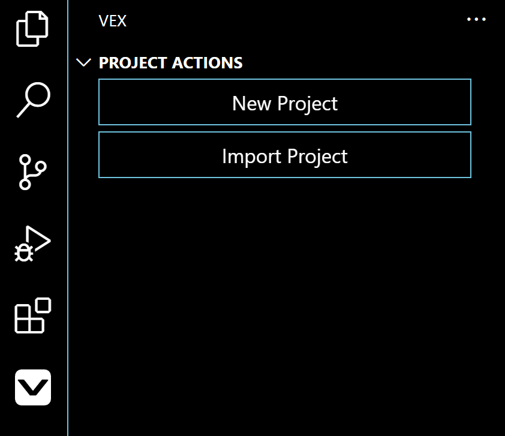
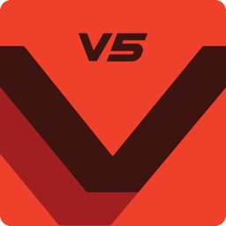
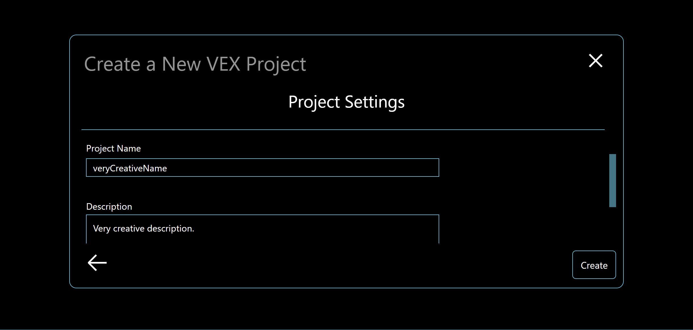
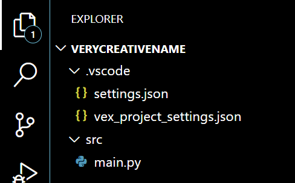
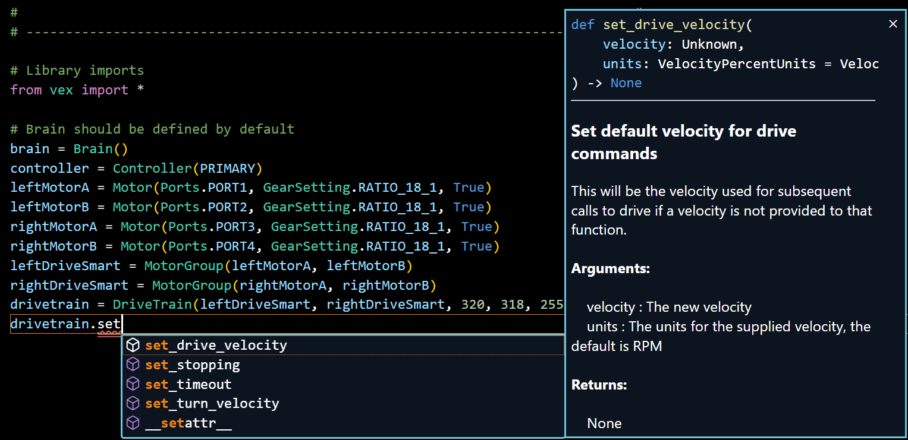

# Introduction to VEXcode V5 Python
This guide provides an introduction to hte basics VEXcode Python. If you prefer video tutorials,
you can also check out our [video guide](https://github.com/9204A-B/intro-python?tab=readme-ov-file#video-guide).  

## Getting Started  

Start by installing Visual Studio Code from [here](https://code.visualstudio.com/download).  
Just run the .exe file and agree to the terms.  
Once installed, VS Code should look like this:  
  

Next press Ctrl + Shift + X and type in "VEX Robotics" and install the VEX extension.  
  
Once installed you should see a new icon that looks like this:  
  

## Creating a project

In the new window select "New Project"
  
Choose the V5 option. Note: This guide is meant for V5, so IQ/EXP may not work the same way.  
  
Next select Python. If you're looking for the C++ guide it's [here](https://github.com/9204A-B/intro-Cpp).
</img>  

There are options for templates, but for this guide, we'll use the empty project.
Give your project a name.
  

You should see 3 files inside of the Explorer tab now.  
  

We'll only modify the "main.py" file.  
One of the useful features of VSCode is that it will show you how the function you're calling is defined.
  

A basic 4 motor drivetrain with an addition motor could look like this: 
```python
    from vex import *  

    #Initalize all devices  

    brain = Brain()  
    controller = Controller(PRIMARY)  
    leftMotorA = Motor(Ports.PORT1, GearSetting.RATIO_18_1, True)  
    leftMotorB = Motor(Ports.PORT2, GearSetting.RATIO_18_1, True)
    rightMotorA = Motor(Ports.PORT3, GearSetting.RATIO_18_1, False)
    rightMotorB = Motor(Ports.PORT4, GearSetting.RATIO_18_1, False)
    leftDriveSmart = MotorGroup(leftMotorA, leftMotorB)
    rightDriveSmart = MotorGroup(rightMotorA, rightMotorB)
    drivetrain = DriveTrain(leftDriveSmart, rightDriveSmart, 320, 318, 255, MM, 1)
                        # Don't worry about these numbers VS Code will tell you what it means
    flyWheel = Motor(Ports.PORT5, GearSetting.RATIO_18_1)

    #Simple arcade drive setup
    def arcade():
        while True:
                                    # Axis 3 is left stick left and right
                                    # Axis 4 is left stick up and down
                                    # Axis 1 is right stick left and right
                                    # Axis 2 is right stick up and down 
            leftDriveSmart.set_velocity((controller.axis3.position() + controller.axis1.position()), PERCENT)
            rightDriveSmart.set_velocity((controller.axis3.position() - controller.axis1.position()), PERCENT)
            leftDriveSmart.spin(FORWARD)
            rightDriveSmart.spin(FORWARD)
        # If there is no wait then the controller can't control the drivetrain
            wait(20, MSEC)

    Thread(arcade)

    spin = False

    def whenStarted():
        drivetrain.set_stopping(BRAKE)
        flyWheel.set_stopping(COAST)
    
    def auton():
        drivetrain.drive_for(FORWARD, 69, INCHES)

    def drive():
        # You can call other functions, threads, ect. Anything you want to happen when the driver has control otherwise write pass
        pass

    def spinFlyWheel():
        global spin
        if not spin:
            flyWheel.set_velocity(100, PERCENT)
            flyWheel.spin(FORWARD)
        else:
            flyWheel.stop()
            flyWheel.set_velocity(0, PERCENT)
    
    # Write event handlers here
    controller.buttonL2.pressed(spinFlyWheel)
    competition = Competition(drive, auton)
    # Wait so everything is registered correctly
    wait(15, MSEC)
```
You can look at the nightmare of our competition code [here](https://github.com/9204A-B/OverUnder/blob/main/Arcade%20Drive/src/main.py). If your code reaches this point consider changing to C++  
## Running Your Program  
Upload by connecting the brain to the PC, and you'll see a download button appear in the bottom left corner.  
  

**From the Controller**  
  
Navigate using the arrow keys, select programs, navigate to the selected slot, and hit run.

**From the Brain**  
  
Click on the program at the bottom or select the programs folder to see everything.

## Summary  
This guide servers as a good starting point for basic competition code. However, due to limited code organization in Python, consider switching to [C++](https://github.com/9204A-B/intro-Cpp) for more complex projects.  

## Additional Resources
[VEXcode V5 Python API Documentation](https://www.robotmesh.com/studio/content/docs/vexv5-python/html/index.html)  
[YouTube Guide](https://youtube.com/playlist?list=PLkJYTVlbDhUbdypypS46la5xFOnpnOFFX&si=pMRX561FNS6AxHgY)  

## Authors
[Logan Dresel](https://github.com/coollogan876)
